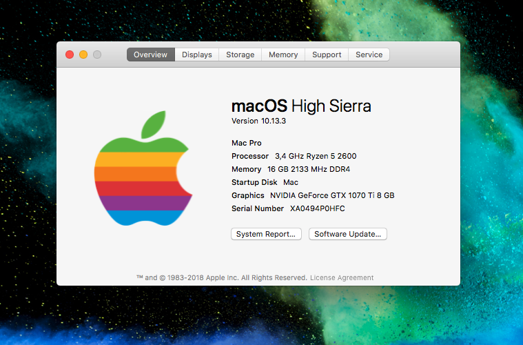

# Hackintosh Project

## Build

 _ | Component
--- | --- 
CPU  |  Ryzen 5 2600
MOBO | AORUS B450 I PRO WIFI 
GPU  |  Asus GTX 1070 Ti TURBO
SSD  |  Samsung 970 EVO 250Gb
RAM  |  Corsair Vengeance 2x8Gb 3000Mhz

## Clover EFI boots
### v0
- Norton/Shanee AMD V3 Unofficial
### v1
- Webdriver Nvidia flag activated + Lilu + Nvidia Kext
- NVME PciAdress built-in patched at port 01:00.00, after that `run sudo    trimforce enable`
- Temp monitor (FakeSMC)
- CPU busratio, busspeed and frequency
- Bluetooth USB Manual Fixes (Algrey forum solution)
### v2 
- RehabMan PatchRAMv1 (Fix for BT at reboot)
- NVRAM dongle BT by default: `sudo nvram bluetoothHostControllerSwitchBehavior=always`
### TODO
- Update Lilu
- Test csmVideo for ultrawide resolution compatibilty at loading screen (May arise  some issues)
- Remove extra clover boot options
- Find out way to boot to windows/macOS next time from OS (startup disk)